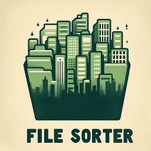

###### Brought to you by Roomys

Sorting files can be tedious and time-consuming, so I bring to you the File Sorter! Because even files need a bit of satisfaction.

---

### Pre-requisites

- JDK- / JRE- / Java version 7+
- Have [Final JAR](./Final%20JAR) ready locally via `git clone https://github.com/AbrieRas/File-Sorter.git`

---

### Result preview

---

## User guide

1. Run the .bat file in the Final JAR folder
(for linux: open bash, `cd` in the folder location and run `java -jar FileSorter.jar`) >

Notice application runs

2. Click on the ***Choose Folder To Scan*** button,
select the desired folder (or paste folder path in the ***Folder name*** field),
click on the ***Open*** button to scan the selected folder >

Notice file path, chosen folder name and files/folders in chosen path

3. (Optional) Click on the ***Show Subfolders*** button >

Notice all sub folders in chosen path (from step 2)

4. (Optional) Click on the ***Choose Save/Output Folder*** button,
select the desired folder to save/output results (or paste folder path in the ***Folder name*** field),
click on the ***Open*** button to confirm the save/output folder >

Notice save/output folder name change

5. In the left pane, click on either:
   1. the individual checkboxes as desired OR
   2. the ***Select All***- or ***Deselect All*** button to consider the selected file(-s)/folder(-s) on the next step >

6. Click on ***Scan for file extensions*** button to scan the selected files/folders for unique file extensions >

Notice found file extensions in selected files/folders

7. In the right pane, click on either:
    1. the individual checkboxes as desired OR
    2. the ***Select All***- or ***Deselect All*** button to consider the selected file extension(-s) on the next step >

8. Click on the ***Sort Files*** button to sort the files in their respective file extensions.
Once the file extension(-s) have been sorted, the file extension(-s) will be removed from the found extensions checkbox list. 
 📌**Note**: This step cannot be un-done.

Notice the sorted files in their respective file extension folders

Notice all the moved file extensions

---

## Folder explanation

| **Folder**                                                 | **Description**                                   |
|------------------------------------------------------------|---------------------------------------------------|
| [Final JAR](./Final%20JAR)                                 | File Sorter app                                   |
| [Example (after sorting)](./Example%20(after%20sorting))   | View File Sorter output/result                    |
| [Example (before sorting)](./Example%20(before%20sorting)) | Example for testing                               |
| [Picture Guide](./Picture%20Guide)                         | Follow with [User guide](#User-guide) for comfort |

---

## Button actions/manual

| **Button**                              | **Function**                                                                                                                                                                                                                                                                                                                                                                                                                                                                                  |
|-----------------------------------------|-----------------------------------------------------------------------------------------------------------------------------------------------------------------------------------------------------------------------------------------------------------------------------------------------------------------------------------------------------------------------------------------------------------------------------------------------------------------------------------------------|
| Choose Folder To Scan                   | Prompts the user to select a directory/folder to scan for files and/or folders. This will list all files/folders in the chosen directory/folder (if any).                                                                                                                                                                                                                                                                                                                                     |
| Show Subfolders                         | Lists all the sub-directories/-folders in the user selected directory/folder (if any).                                                                                                                                                                                                                                                                                                                                                                                                        |
| Choose Save/Output Folder               | Prompts the user to select a directory/folder where the sorting results will be exported/moved to. A directory/folder named "Output" will be created in the user selected directory/folder and used for generating folders based on file extensions that need to be sorted. By default, the folder to scan is selected.                                                                                                                                                                       |
| Checkbox (left panel)                   | File/Directory/Folder result checkbox from selecting a directory/folder to scan.                                                                                                                                                                                                                                                                                                                                                                                                              |
| Select All (left panel & right panel)   | Checks/Selects all checkboxes in the respective panel (left- or right panel).                                                                                                                                                                                                                                                                                                                                                                                                                 |
| Deselect All (left panel & right panel) | Unchecks/Deselects all checkboxes in the respective panel (left- or right panel).                                                                                                                                                                                                                                                                                                                                                                                                             |
| Scan for file extensions                | The checked/selected checkbox(-es) in the left panel will be searched for unique file extensions e.g. `.txt` and then added as checkbox(-es) to the right-hand panel as results. Unchecked/Deselected files will not be scanned.                                                                                                                                                                                                                                                              |
| Checkbox (right panel)                  | A unique file extension e.g. `.txt` that was found in the left panel's checked/selected file/directory/folder checkbox(-es), which is inserted as checkbox(-es) in the right-hand panel.                                                                                                                                                                                                                                                                                                      |
| Sort Files                              | Moves all existing checked/selected file extensions from the previously checked/selected folders to the user (or default) selected save/output directory/folder. The folders that are scanned for the file extensions, are calculated/considered/selected based on when the ***Scan for file extensions*** button is used. The ***Sort Files*** button therefore only considers the checked/selected file extensions checkbox(-es) in this step. 📌**Note**: This step cannot be un-done. |
